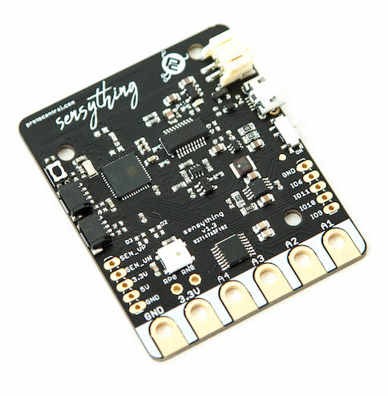
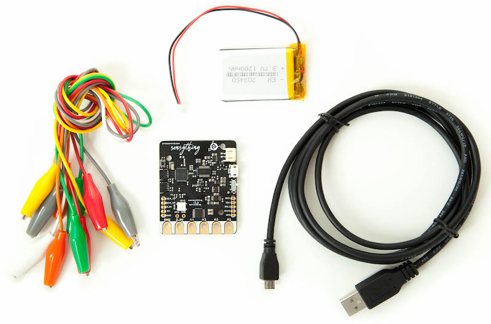

Sensything is a Data- acquisition board with the added capabilities of ADC precision (ADS1220). The board contains an ESP-32 microcontroller with Qwiic connectivity that is most suitable for IOT applications. Using one single platform to monitor sensor readings along with the support of an BLE Application and Web server just makes it all the more advanced and simplifies solutions.

If you don't already have one, you can now buy Sensything from [Crowd Supply](https://www.crowdsupply.com/protocentral/sensything)

## Getting started with the Sensything Basic kit

The Sensything basic kit is put together to work **out of the box**, which means that is is ready to without any additional programming required.

### What’s in the box?
* 1x Sensything main Board
* 1x 1000 mAH, 3.7V Li-Po battery
* 10x alligator cables
* 1x micro USB cable

If you have purchased the *Sensything - board only* version then you will have to bring your own battery, and cables.



### Power it up

This video throws light on how to set up your Sensything device.
Video:Power it up

### Install the Sensything app for Android

Download the App and connecting couldn’t have been much easier.
Video: Play store

### Using the App
Easy connect with just a click. Pay attention to the RGB indication.
Video: Using the App

## Connecting analog sensors to Sensything

A sensor is a measure of the changes that occur in the physical environment, or it's your chance to interface with the physical world. It collects this data and provides an analog voltage as an output.The output range usually varies from 0 to 5 volts, for most of them.

Some basic examples of how to connect to Analog sensors

## Using Sensything with Arduino

This document explains how to connect your Sensything to the computer and upload your first sketch. The Sensything is programmed using the Arduino Software (IDE), the Integrated Development Environment runs both online and offline. Starting the basics of electronics, to more complex projects, the kit will help you control the physical world with sensor and actuators.

Setting up Arduino to ESP32
Welcome to sensything with arduino! Before you start controlling the world around you, you�ll need to set up the software to program your Sensything.

### Step 1: Download and Install the IDE
The Arduino Software (IDE) allows you to write programs and upload them to your sensything. Now you require arduino Desktop IDE you can download the latest version using the below link. **https://www.arduino.cc/en/Main/Software#download**


Once downloaded, install the IDE and ensure that you enable most (if not all) of the options, INCLUDING the drivers.

### Step 2: Get the Sensything COM Port Number
Next, youll need to connect the Sensything board to the computer. This is done via a USB connection. When the Sensything is connected, the operating system should recognize the board as a generic COM port. The easiest way to do this is to type device manager into Windows Search and select Device Manager when it shows.


In the Device Manager window, look for a device under �Ports (COM & LPT), and chances are the Arduino will be the only device on the list

### Step 3: Configure the IDE
Now that we have determined the COM port that the Arduino is on, it's time to load the Arduino IDE and configure it to use the same device and port. Start by loading the IDE. Once it's loaded, navigate to Tools > Board > Esp32 dev module.


Next, you must tell the IDE which COM port the Sensything is on. To do this, navigate to Tools > Port > COM51. Obviously, if your Sensything is on a different port, select that port instead.
{Selecting port}

## Writing a simple ADS1220 acquisition

### ADS1220 Acquisition


Here is the ads1220 acquisition code to read the four analog channels.
A header file is generally used to define all the functions, variables and constants contained in any function library that you might want to use, define the pin number of ads1220 Chipselect and DRDY.
```c
#include "Protocentral_ADS1220.h"
#define ADS1220_CS_PIN    4
#define ADS1220_DRDY_PIN  34
```
Initialize the onboard ADS1220 ADC with begin
```c
void setup()
{
    Serial.begin(9600);

    pc_ads1220.begin(ADS1220_CS_PIN,ADS1220_DRDY_PIN);

    pc_ads1220.set_data_rate(DR_330SPS);
    pc_ads1220.set_pga_gain(PGA_GAIN_1);
    pc_ads1220.set_conv_mode_single_shot(); //Set Single shot mode
 }
```
In the loop function below we get the ADC data for Channel 0 The same code can be applied to channel 1, channel 2 and channel 3.

```c
void loop()
{
    adc_data=pc_ads1220.Read_SingleShot_SingleEnded_WaitForData(MUX_SE_CH0);
    Serial.print("\n\nCh1 (mV): ");
    Serial.print(convertToMilliV(adc_data));
    delay(100);  
}
```  
Converting the adc data into millivolt
```c
float convertToMilliV(int32_t i32data)
{
    return (float)((i32data*VFSR*1000)/FULL_SCALE);
}
```

Getting the above code is as easy as installing the Arduino library https://github.com/Protocentral/Protocentral_ADS1220 and loading the simple ads1220 data acquisition example, from  click File > Open > Protocentral_ADS1220.


With the ads1220 acquisition loaded, its time to verify and upload the code. The verify stage checks the code for errors, then compiles the ready-for-uploading code to the Arduino. The upload stage actually takes the binary data, which was created from the code, and uploads it to the Sensything via the serial port.

To verify and compile the code, press the check mark button in the upper left window.


If the compilation stage was successful, you should see the following message in the output window at the bottom of the IDE. You might also see a similar messages just that its one that does not have words like ERROR and WARNING.
This is a successful compilation.


With the code compiled, you must now upload it the Sensything. To do this, click the arrow next to the check mark.
The �Upload� button will program the Arduino with your code.


 You can get the ads1220 4-channels analog readings in the Serial Monitor.


# License Information

This product is open source! Both, our hardware and software are open source and licensed under the following licenses:

## Hardware

All hardware is released under [Creative Commons Share-alike 4.0 International](http://creativecommons.org/licenses/by-sa/4.0/).


## Software

All software is released under the MIT License(http://opensource.org/licenses/MIT).

Please check [*LICENSE.md*](LICENSE.md) for detailed license descriptions.

THE SOFTWARE IS PROVIDED "AS IS", WITHOUT WARRANTY OF ANY KIND, EXPRESS OR IMPLIED, INCLUDING BUT NOT LIMITED TO THE WARRANTIES OF MERCHANTABILITY, FITNESS FOR A PARTICULAR PURPOSE AND NON-INFRINGEMENT. IN NO EVENT SHALL THE AUTHORS OR COPYRIGHT HOLDERS BE LIABLE FOR ANY CLAIM, DAMAGES OR OTHER LIABILITY, WHETHER IN AN ACTION OF CONTRACT, TORT OR OTHERWISE, ARISING FROM, OUT OF OR IN CONNECTION WITH THE SOFTWARE OR THE USE OR OTHER DEALINGS IN THE SOFTWARE.
